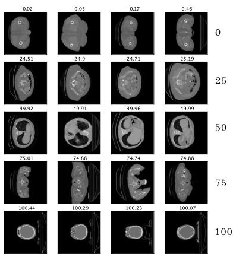
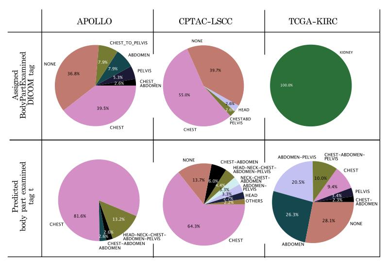
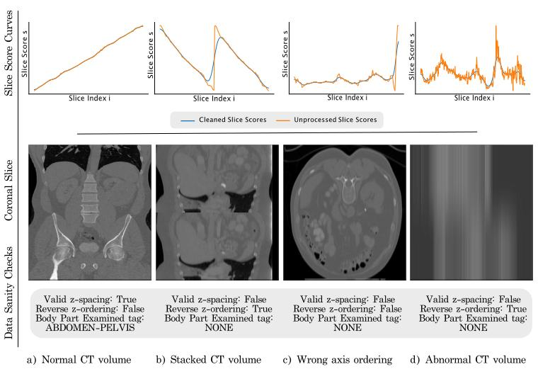
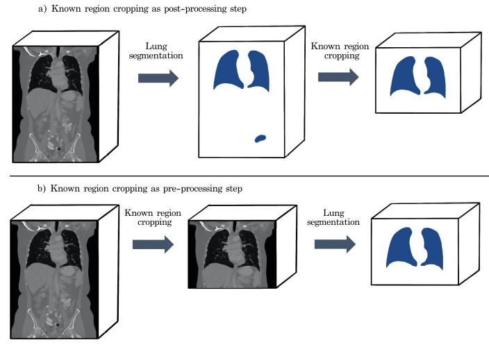

Copyright © German Cancer Research Center (DKFZ), Division of Medical Image Computing (MIC). Please make sure that your usage of this code is in compliance with the code license:
[](https://github.com/MIC-DKFZ/basic_unet_example/blob/master/LICENSE)

--------------------------------------------------------------


# Body Part Regression 

The Body Part Regression (BPR) model translates the anatomy in a radiologic volume into a machine-interpretable form. 
Each axial slice maps to a slice score. The slice scores monotonously increase with patient height. In the following figure, you can find example slices for the predicted slice scores: 0, 25, 50, 75, and 100. In each row independent random CT slices are visible with nearly the same target. It can be seen, that the start of the pelvis maps to 0, the upper pelvis region maps to 25, the start of the lungs to 50, the shoulder region to 75, and the head to 100: 



With the help of a slice-score look-up table, the mapping between certain landmarks to slice scores can be checked. 
The BPR model learns in a completely self-supervised fashion. There is no need for annotated data for training the model, besides of evaluation purposes. 

The BPR model can be used for sorting and labeling radiologic images by body parts. Moreover, it is useful for cropping specific body parts as a pre-processing or post-processing step of medical algorithms. If a body part is invalid for a certain medical algorithm, it can be cropped out before applying the algorithm to the volume. 

The Body Part Regression model in this repository is based on the SSBR model from [Yan et al.](https://arxiv.org/pdf/1707.03891.pdf) 
with a few modifications explained in the master thesis "Body Part Regression for CT Volumes". 

For CT volumes, a pretrained model for inference exists already. 
With a simple command from the terminal, the body part information can be calculated for nifti-files.  


--------------------------------------------------------------
## 1. Install package
You can either use conda or just pip to install the bpreg package. 

## 1.1 Install package without conda

1. Create a new python environment and activate it through: 
```
python -m venv venv_name
source venv_name/bin/activate
```

2. Install the package through: 
```
pip install bpreg
```

### 1.2 Install package with conda

1. Create new conda environment and activate environment with: 
```
conda create -n venv_name
conda activate venv_name
```
2. Install pip into the environment
```
conda install pip
```
3. Install the package with pip through the command (with your personal anaconda path): 
```
/home/anaconda3/envs/venv_name/bin/pip install bpreg
```
You can find your personal anaconda path through the command: 
```
which anaconda
```


--------------------------------------------------------------

## Analyze examined body parts
The scope of the pretrained BPR model for CT volumes are body parts from adults from the beginning of the pelvis to the end of the head. Note that due to missing training data, children, pregnant women or legs are not in the scope of the algorithm.
To obtain the body part information for nifti-files you need to provide the nifti-files with the file ending *.nii or *.nii.gz in one directory and run the following command: 
```
bpreg_predict -i <input_path> -o <output_path>
``` 
Tags for the `bpreg_predict` command: 
- `-i` (str): input path, origin of nifti-files
- `-o` (str): save path for created meta-data json-files
- `--skip` (bool): skip already created .json metadata files (default: 1)
- `--model` (str): specify model (default: public model from zenodo for CT volumes)
- `--plot` (png): create and save plot for each volume with calculated slice score curve. 
- 
Through the `bpreg_predict` command for each nifti-file in the directory `input_path` a corresponding json-file 
gets created and saved in the `output_path`. Moreover, a README file will be saved in the output path, where the information inside the JSON files is explained. 

If your input data is not in the nifti-format you can still apply the BPR model by converting the data to a numpy matrix. 
A tutorial for using the package for CT images in the numpy format can be found in the notebook: `docs/notebooks/inference-example-with-npy-arrays`.

If you use this model for your work, please make sure to cite the model and the training data as explained at 
[zenodo](https://zenodo.org/record/5113483#.YPaBkNaxWEA). 

The meta-data files can be used for three main use cases. 
1. Predicting the examined body part
2. Filter corrupted CT images
3. Cropping required region from  CT images 


### 1. Predicting the examined body part
The label for the predicted examined body part can be found under `body part examined tag` in the meta-data file. 
In the following figure, you can find a comparison between the BodyPartExamined tag from the DICOM meta-data header and the predicted `body part examined tag` from this method.
The predicted body part examined tag is more fine-grained and contains less misleading and missing values than the BodyPartExamined tag from the DICOM header: 




### 2. Filter corrupted CT images 
Some of the predicted body part examined tags are `NONE`, which means that the predicted slice score curve for this CT volume looks unexpected (then the`valid z-spacing` tag from the meta-data is equal to 0). Based on the `NONE` tag corrupted CT volumes can be automatically found. In the following, you find in the left a typical CT volume with a corresponding typical slice score curve. Next to the typical CT volume several corrupted CT volumes are shown with the corresponding slice score curves. It can be seen that the slice score curves from the corrupted CT volumes are clearly different from the expected slice score curve. If the slice score curve is looking is monotonously increasing as in the left figure but the predicted body part examined tag is still `NONE` then this happens because the z-spacing of the CT volume seems to be wrong. 




### 3. Cropping required region from CT images
The meta-data can be used as well to crop appropriate regions from a CT volume. 
This can be helpful for medical computer vision algorithms. It can be implemented as a pre-processing or post-processing step and leads to less false-positive predictions in regions which the model has not seen during training: 



--------------------------------------------------------------

## Structure of metadata file
The json-file contains all the metadata regarding the examined body part of the nifti-file. It includes the following  tags: 
- `cleaned slice-scores`: Cleanup of the outcome from the BPR model (smoothing, filtering out outliers). 
- `unprocessed slice-scores`: Plain outcome of the BPR model. 
- `body part examined`: Dictionary with the tags: "legs", "pelvis", "abdomen", "chest", "shoulder-neck" and "head". For each body-part, the slice indices are listed, where the body part is visible. 
- `body part examined tag`: updated tag for BodyPartExamined. Possible values: PELVIS, ABDOMEN, CHEST, NECK, HEAD, HEAD-NECK-CHEST-ABDOMEN-PELVIS, HEAD-NECK-CHEST-ABDOMEN, ... 
- `look-up table`: reference table to be able to map slice scores to landmarks and vise versa. 
- `reverse z-ordering`: (0/1) equal to one if patient height decreases with slice index. 
- `valid z-spacing`: (0/1) equal to one if z-spacing seems to be plausible. The data sanity check is based on the slope of the curve from the cleaned slice-scores.

The information from the meta-data file can be traced back to the `unprocessed slice-scores` and the `look-up table`. 


--------------------------------------------------------------

## Documentation for Body Part Regression 

In the `docs/notebooks` folder, you can find a tutorial on how to use the body part regression model for inference. An example will be presented, were the lungs are detected and cropped automatically from CT volumes. Moreover, a tutorial for training and evaluating a Body Part Regression model can be found. 

For a more detailed explanation to the theory behind Body Part Regression and the application use cases have a look into the master thesis "Body Part Regression for CT Images" from Sarah Schuhegger. 

--------------------------------------------------------------
### Cite Software 
Sarah Schuhegger. (2021). MIC-DKFZ/BodyPartRegression: (v1.0). Zenodo. https://doi.org/10.5281/zenodo.5195341
